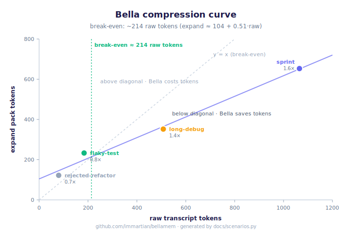

# Bella scenarios — entropy reduction, structural preservation, token compression

Synthetic conversations that demonstrate Bella's compression story
with reproducible numbers. Generated by `docs/scenarios.py`. Pinned by
`tests/test_scenarios.py` so they can't silently drift.

## Headline metrics

- **Break-even: ~214 raw transcript tokens** (synthetic linear fit). Below this, Bella costs tokens; above, it saves.
- **At production scale (~35k tokens of conversation): compression ratio jumps to ~19×.** The linear model under-predicts by 10× because it assumes `expand` grows with raw size — at scale, `expand` is bounded by the user's budget, not by raw size. See the [production data point](#production-data-point) section below.

Linear fit across 4 synthetic scenarios: `expand ≈ 106 + 0.51 × raw`.

Use Bella for conversations longer than ~200 tokens; for shorter chats, the flat tail is cheaper. Above ~2000 tokens, Bella's compression saturates at the budget you set, and the effective ratio diverges with raw size.

*(SVG generated alongside this report; embed and refresh by running `python docs/scenarios.py`.)*

## Production data point

The four scenarios above are synthetic. To check the linear extrapolation against real behavior, we measured this very Bella development session — a multi-day Claude Code conversation where the assistant fixed two user-reported bugs, refactored the ratification classifier, built this scenarios harness itself, and shipped a PyPI release. The session lives in `~/.claude/projects/-media-im3-plus-labX-bellamem/853e838e-….jsonl`.

| metric | value |
|---|---:|
| user + assistant turns | 291 |
| **raw conversation tokens** | **34,761** |
| Claude Code context window (incl. tool calls, file reads, bash output) | ~515,000 |
| `expand` pack at budget=1500 | 1,805 tokens (37 lines) |
| **empirical compression ratio** | **~19.3×** |
| linear extrapolation predicted | ~17665 tokens (~2.0× ratio) |
| linear under-prediction | **10×** |

The linear synthetic model treats `expand` as proportional to raw transcript size. At small scale (≤2k tokens), that's roughly true because `expand`'s budget isn't binding. At production scale, the budget IS binding, so `expand` returns a fixed-size pack regardless of how big the raw transcript got. The relationship between raw and expand stops being linear and starts being **bounded**: as raw grows, the compression ratio diverges with it. The synthetic chart is the honest worst case; the real ratio at scale is much better.

Note on the 515k vs 34k gap: a Claude Code context window of 515k tokens contains ~6.7% conversation text and ~93.3% tool output (file reads, bash output, search results, system reminders). Bella ingests only the conversation portion — that's the part with decisive structure (decisions, disputes, causes, self-observations). Bella doesn't claim to compress tool output; it claims to compress the conversation that earns the structure. The 19× ratio is on the thing it actually targets.

Read each row as: a dialogue happens, Bella ingests it, time passes,
decay + emerge + prune compress the graph, then a future agent asks
the scenario's test question and gets back an `expand` pack under a
tight token budget. The compression ratio is `raw / expand`.

**Note on small-scenario token math**: Bella's per-belief metadata
overhead (~10 tokens for the `[field] m=0.XX v=N` prefix) means the
raw vs. expand ratio only flips positive once the dialogue is long
enough that overhead amortizes. The `flaky-test` and `rejected-refactor`
scenarios are short enough that the ratio reads <1×; they demonstrate
**structural preservation**, not token compression. The `long-debug`
scenario is sized to show the token win empirically.

| scenario | raw | beliefs (in→out) | entropy (in→out) | expand | ratio | structure | surfaced |
|---|---:|---:|---:|---:|---:|:---:|:---:|
| `flaky-test` | 184 | 11 → 7 | 3.45 → 2.79 | 233 | 0.8× | ✓ | ✓ |
| `rejected-refactor` | 80 | 4 → 3 | 1.99 → 1.58 | 122 | 0.7× | ✓ | ✓ |
| `long-debug` | 508 | 27 → 20 | 4.75 → 4.32 | 352 | 1.4× | ✓ | ✓ |
| `sprint` | 1065 | 52 → 36 | 5.69 → 5.16 | 645 | 1.7× | ✓ | ✓ |

## What each column means

- **raw**: tokens in the verbatim transcript (flat-tail baseline)
- **beliefs in→out**: belief count after ingest → after age + emerge + prune
- **entropy in→out**: Shannon entropy bits of the mass distribution
- **expand**: tokens in the `expand()` pack answering the test question
- **ratio**: raw / expand — the compression factor (only meaningful at scale)
- **structure**: did all disputes, causes, ratifications, and `__self__` observations survive compression? (✓ = none lost)
- **surfaced**: did the load-bearing claims (the scenario's `must_surface` substrings) appear in the expand pack? (the future-session retrieval check)

## Scenario detail

### `flaky-test`

13-turn debugging session: bandaid → rejection → cause chain → ratified fix → self-observation

- **Raw transcript**: 184 tokens (verbatim, the flat-tail baseline)
- **After ingest**: 11 beliefs, entropy 3.45 bits (1 disputes, 2 causes, 1 multi-voice, 1 self-obs)
- **After compression** (60d age + emerge + prune): 7 beliefs, entropy 2.79 bits (1 disputes, 2 causes, 1 multi-voice, 1 self-obs)
- **Compression**: 4 beliefs removed (36% reduction), entropy dropped by 0.65 bits
- **Structure preserved**: yes (every dispute, cause, ratification, and self-obs survived)
- **expand pack**: 233 tokens, 8 lines — what a future agent sees when asking *"why does the integration test keep flaking and what's the fix"*
- **Compression ratio**: 0.8× (raw / expand)
- **Load-bearing claims surfaced**: yes — all of `['jitter', 'rate-limit']` appear in the pack

### `rejected-refactor`

5-turn refactor proposal that the user rejects with a reason from past experience — dispute must survive

- **Raw transcript**: 80 tokens (verbatim, the flat-tail baseline)
- **After ingest**: 4 beliefs, entropy 1.99 bits (1 disputes, 0 causes, 0 multi-voice, 0 self-obs)
- **After compression** (60d age + emerge + prune): 3 beliefs, entropy 1.58 bits (1 disputes, 0 causes, 0 multi-voice, 0 self-obs)
- **Compression**: 1 beliefs removed (25% reduction), entropy dropped by 0.41 bits
- **Structure preserved**: yes (every dispute, cause, ratification, and self-obs survived)
- **expand pack**: 122 tokens, 4 lines — what a future agent sees when asking *"should we refactor the auth middleware into a shared base class"*
- **Compression ratio**: 0.7× (raw / expand)
- **Load-bearing claims surfaced**: yes — all of `['cycles', 'duplicat']` appear in the pack

### `long-debug`

30-turn payment webhook incident: rejected timeout bump → ack-first async pattern → cause chain → self-observation → shipped fix

- **Raw transcript**: 508 tokens (verbatim, the flat-tail baseline)
- **After ingest**: 27 beliefs, entropy 4.75 bits (1 disputes, 1 causes, 1 multi-voice, 1 self-obs)
- **After compression** (60d age + emerge + prune): 20 beliefs, entropy 4.32 bits (1 disputes, 1 causes, 1 multi-voice, 1 self-obs)
- **Compression**: 7 beliefs removed (26% reduction), entropy dropped by 0.43 bits
- **Structure preserved**: yes (every dispute, cause, ratification, and self-obs survived)
- **expand pack**: 352 tokens, 12 lines — what a future agent sees when asking *"how should we handle the payment webhook timeout problem"*
- **Compression ratio**: 1.4× (raw / expand)
- **Load-bearing claims surfaced**: yes — all of `['ack', 'queue']` appear in the pack

### `sprint`

60-turn three-week database performance arc: slow endpoint → rejected index → materialized view → replica lag → rejected primary routing → read-your-writes → schema review decision → self-observation about reaching for indexes before questioning the model

- **Raw transcript**: 1065 tokens (verbatim, the flat-tail baseline)
- **After ingest**: 52 beliefs, entropy 5.69 bits (2 disputes, 2 causes, 6 multi-voice, 2 self-obs)
- **After compression** (60d age + emerge + prune): 36 beliefs, entropy 5.16 bits (2 disputes, 2 causes, 6 multi-voice, 2 self-obs)
- **Compression**: 16 beliefs removed (31% reduction), entropy dropped by 0.53 bits
- **Structure preserved**: yes (every dispute, cause, ratification, and self-obs survived)
- **expand pack**: 645 tokens, 21 lines — what a future agent sees when asking *"what did we learn about database performance and what's the plan"*
- **Compression ratio**: 1.7× (raw / expand)
- **Load-bearing claims surfaced**: yes — all of `['materialized', 'schema']` appear in the pack
